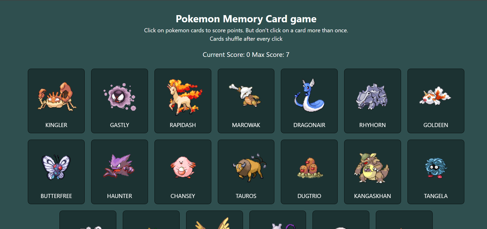
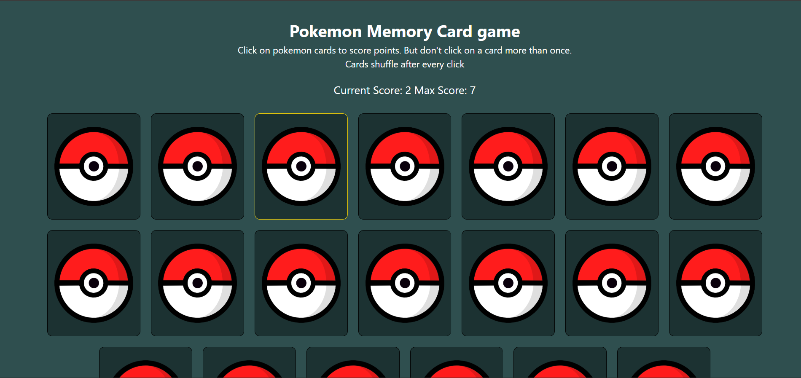

# pokemon-memory-card
Fun little memory card game with Pokemon.

## Rules
The objective is to click all the cards once without clicking on the same card twice.
The cards shuffle after every click.

## Points
Clicking on a card not clicked before: 1 point
Clicking on a card already clicked before: Game Reset

## Screenshots

Starting Screen: 

Clicking on a card (shuffling):

## Acknowledgements

This project uses the [Pokemon API](https://pokeapi.co/) to fetch the beautiful pokemon sprites.